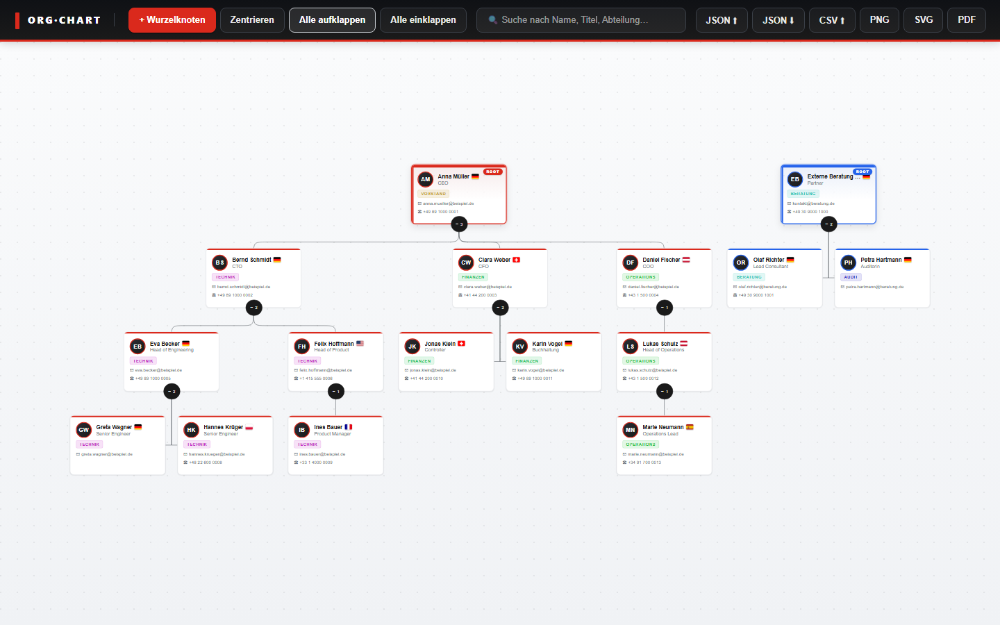
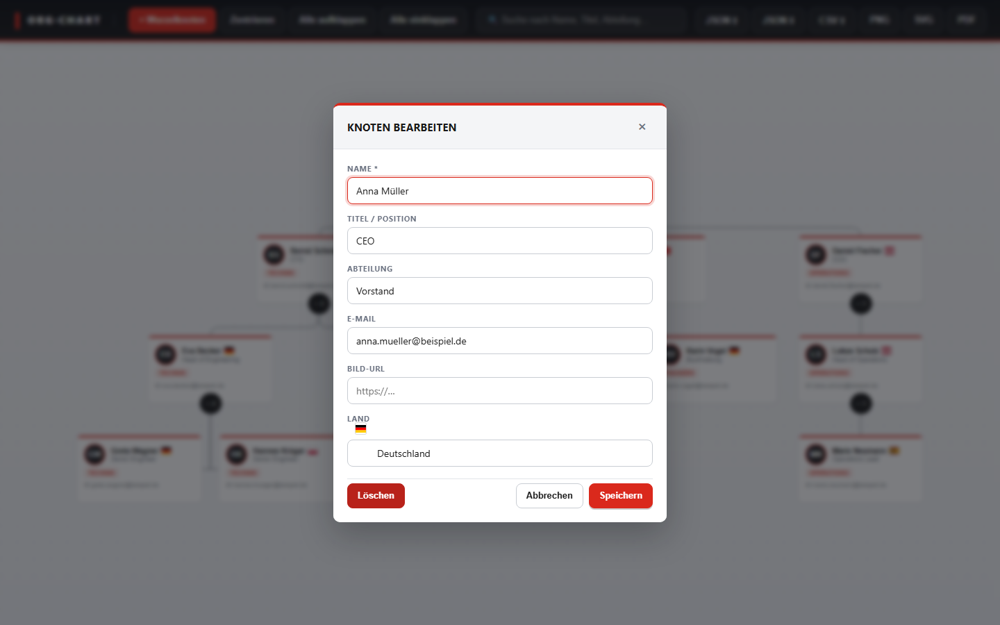
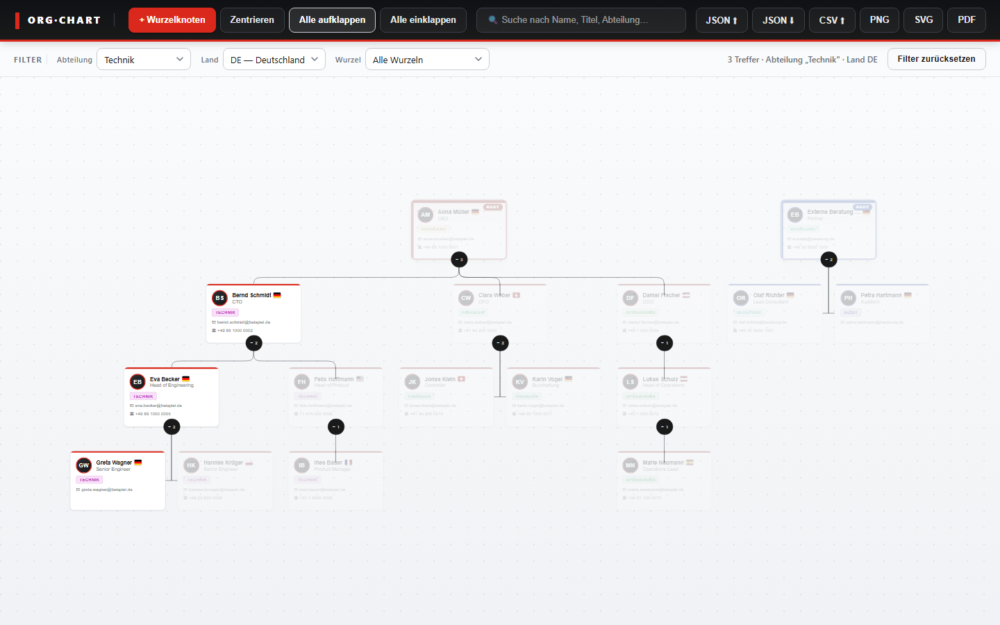

<p align="center">
  
</p>

<h1 align="center">Org-Chart Builder</h1>

<p align="center">
  <a href="https://github.com/xozy22/org-chart/actions/workflows/docker.yml">
    
  </a>
</p>

A browser-based organisational chart builder. TypeScript + [d3-org-chart](https://github.com/bumbeishvili/org-chart) for the SPA, a small Express backend for shared multi-chart storage. Ships as **one Docker image, one process, one port** — point a host directory at `/app/data` and you're done.



---

## What you get

### Workspaces (multi-chart)

| Area | What it does |
|---|---|
| **Multiple charts** | The toolbar shows a `🗂 <chart name>` button. Click to open a modal with every chart, its tags, size and last-updated timestamp. |
| **CRUD** | Create / rename / re-tag / duplicate / delete charts. ★ flips the default — the chart loaded on the next visit. |
| **Tag filter & search** | Free-text search filters by name and tag; tag chips toggle as multi-select filters. |
| **Optimistic locking** | Every save sends an `If-Match: <etag>` header. Concurrent edits surface a conflict modal: load server, force local, or cancel. |
| **Per-user view-state** | Free-layout positions and the `auto`/`free` mode are stored per-chart in the browser, so each viewer has their own placement on top of the same shared content. |
| **Offline fallback** | If the backend isn't reachable, the app silently falls back to single-chart `localStorage` mode. |

### Cards & data

| Area | What it does |
|---|---|
| **Card content** | Avatar (image or auto-initials), name, title, department badge, email, phone, country flag |
| **Clickable contacts** | Email = `mailto:` link, phone = `tel:` link. Per-field copy icon on hover; per-card menu and toolbar action either copy the node as plain text **or download an RFC-6350 vCard (`.vcf`)** ready to import into Apple Contacts / Outlook / Google. Multi-select (Ctrl+Click) bundles every selected node into a single `<chart>_vcards_<date>.zip`. |
| **Custom fields** | User-defined extras (text / number / date / url / email) with toggleable card visibility |
| **Multi-root** | Any number of `parentId: null` nodes; each subtree gets a stable colour container with a `ROOT` badge that descendants inherit |
| **Departments** | Auto-suggest dropdown of every known department + 11-colour palette + custom colour picker, shared by every card in the same department |

### Layout

| Area | What it does |
|---|---|
| **Auto** | d3-org-chart's flex-tree algorithm. Expand / collapse pills, auto-fit. |
| **Free** | 20-px grid, drag every card into place. Lines follow live, manual positions persist independently per chart and per browser, flip back to auto without losing them. |
| **Drag-to-reparent** | Drop any card onto another to re-parent (built into d3-org-chart) |

### Discovery

| Area | What it does |
|---|---|
| **Search & filter** | Free-text search plus structured filter dropdowns (department, country, root). Non-matches dim while keeping the hierarchy intact. |
| **URL state** | Active filters mirror to the location hash (`#dept=Technik&country=de`) — every view is shareable as a link |
| **Multi-select & bulk** | Ctrl/Cmd-click to multi-select; floating bulk bar with delete, change-department, change-country; "Markierte Knoten" submenu in the **Aktionen ▾** dropdown copies the selection as text or downloads it as a vCard ZIP |
| **Stats sidebar** | KPI tiles + bar charts: total / roots / departments / countries / avg & max depth, completeness ratios, top departments and countries |
| **Minimap** | Bottom-right canvas overview, dims off-screen area, click-to-recentre |
| **Zoom controls** | Bottom-left FAB cluster (Google-Maps style): `+`, `−`, `⊕` Fit. Wheel and pinch keep working. |

### Edit, share, persist

| Area | What it does |
|---|---|
| **Undo / redo** | 50-step history with toolbar buttons + `Ctrl+Z` / `Ctrl+Y` / `Ctrl+Shift+Z`; covers every edit, drag, bulk action and layout-mode toggle |
| **Country flags** | 59 countries via [`flag-icons`](https://github.com/lipis/flag-icons), datalist autocomplete by name or ISO-2 code |
| **Image export** | High-quality PNG (2× pixel ratio), self-contained SVG, A4 PDF — every CSS rule and flag image is inlined so the export looks identical to the live view |
| **JSON / CSV import & export** | v3 envelope with nodes, departments **and** custom-fields schema; legacy v2 + bare-array forms still accepted |
| **Contact export (vCard)** | Single node → `.vcf` download; multi-select → ZIP bundle of one `.vcf` per node, ready to drag into Apple Contacts, Outlook or Google Contacts. UTF-8 BOM and `text/vcard` MIME type set so Windows mail clients detect the encoding. |





---

## Keyboard shortcuts

| Key | Action |
|---|---|
| `Ctrl+Z` | Undo |
| `Ctrl+Y` / `Ctrl+Shift+Z` | Redo |
| `Esc` | Close any modal / clear multi-select |
| `Ctrl+Click` on a card | Toggle that card in the multi-selection |

Wheel / pinch on the canvas zooms; click-and-drag on empty space pans.

---

## Quick start (Docker)

```bash
docker run -d --name org-chart \
  -p 8080:3000 \
  -v "$PWD/data":/app/data \
  ghcr.io/xozy22/org-chart:latest

open http://localhost:8080
```

That's it — one image, one container, one volume. Everything (frontend
SPA + REST API + chart storage) is served by the same Node process on
port 3000 inside the container.

### docker-compose

A ready-to-use compose file ships in the repo:

```bash
docker compose up -d
# → http://localhost:8080
```

```yaml
services:
  org-chart:
    image: ghcr.io/xozy22/org-chart:latest
    ports:
      - "8080:3000"
    volumes:
      - ${ORG_CHART_DATA:-./data}:/app/data
    restart: unless-stopped
```

---

## Storage & volume mount

The container expects **one directory mounted at `/app/data`**. Inside it
the backend creates two things:

```
/app/data/
├── charts.index.json          ← list of {id, name, tags, default, etag, …}
└── charts/
    ├── <uuid>.json            ← full chart payload
    ├── <uuid>.json
    └── …
```

> 💡 **Drop-in import** — any `*.json` file you copy into `<data>/charts/`
> is auto-imported on startup *and* live while the container runs (file
> watcher). Filenames that aren't already UUIDs get renamed to the
> minted UUID; the original filename becomes the chart's display name.
> See [Drop-in import](#drop-in-import-auto-discover-json-files) below.

The host path is up to you. Pick whichever pattern fits:

### Bind-mount a host folder (most common)

```yaml
volumes:
  - /srv/org-chart/data:/app/data            # absolute path
  # - ./data:/app/data                       # relative to compose file
  # - ${ORG_CHART_DATA:-./data}:/app/data    # env-var override (default in this repo)
```

```bash
ORG_CHART_DATA=/srv/org-chart/data docker compose up -d
```

The directory is created on first start. Charts then live as
`/srv/org-chart/data/charts/<id>.json`. Move it to a NAS, an SMB share
or an encrypted volume — the backend doesn't care as long as it has
read/write access.

### Named Docker volume (recommended for production)

```yaml
services:
  org-chart:
    volumes:
      - org_chart_data:/app/data

volumes:
  org_chart_data:
```

`docker volume inspect org_chart_data` shows the on-disk location.
Survives `docker compose down`; only `down -v` deletes it.

### Override the in-container path

If `/app/data` collides with something in your environment, change it:

```yaml
services:
  org-chart:
    environment:
      - DATA_DIR=/var/lib/orgchart
    volumes:
      - /srv/org-chart/data:/var/lib/orgchart
```

### File ownership

The container starts as **root** so the entrypoint can `chown` the
mounted data directory to the in-container `app` user, **then drops
privileges before running Node**. That means a plain
`docker run -v /any/host/path:/app/data …` Just Works™ regardless of
how the host directory is owned.

You'll see this on first start:

```
[entrypoint] adjusting ownership of /app/data (was 1000:1000 → 100:101)
```

If `chown` itself fails (read-only mount, SMB/NFS without write access,
SELinux label mismatch on RHEL/Fedora), the entrypoint logs a warning and
the API still starts — you'll get `503 Storage volume is not writable`
on every write request until the host permissions are fixed.

**Force a specific UID/GID** (skip the auto-chown — useful when you want
the on-disk files owned by *your* user for editing or backups):

```yaml
services:
  org-chart:
    user: "${UID:-1000}:${GID:-1000}"
```

In that case make sure your host directory matches:

```bash
chown -R "$(id -u):$(id -g)" /srv/org-chart/data
```

**SELinux** (RHEL / Fedora / CentOS): add the `:Z` mount flag so the
volume gets relabeled for container access:

```yaml
volumes:
  - /srv/org-chart/data:/app/data:Z
```

### Drop-in import (auto-discover JSON files)

The backend automatically picks up any `*.json` file you drop into
`<data>/charts/`. Two paths to do it:

**1. Bulk seed before first start** — perfect for a fresh installation
where you already have a few exports:

```bash
mkdir -p data/charts
cp ~/exports/acme-corp.json     data/charts/
cp ~/exports/eu-operations.json data/charts/

docker compose up -d
# Container log:
#   [auto-import] boot scan: imported 2 chart(s)
#   [auto-import]   + acme-corp     (acme-corp.json     → 7d4a…)
#   [auto-import]   + eu-operations (eu-operations.json → 9c81…)
```

Both charts are immediately visible in the workspace modal. The first
auto-imported chart becomes the default; rename / re-tag / re-default
from the UI as usual.

**2. Live drop while the container is running** — chokidar watches the
directory, so:

```bash
cp another-chart.json /srv/org-chart/data/charts/
# ~1 second later, no restart needed:
#   [auto-import] live reconcile: imported=1 renamed=1 skipped=0
#   [auto-import]   + another-chart  (another-chart.json → 4e2f…)
```

**What gets accepted as a payload** — both forms produced by the app's
own JSON export work:

```jsonc
// v3 envelope (what the toolbar's "Datei → JSON exportieren" produces)
{ "version": 3, "nodes": [...], "departments": {...}, "customFields": [...] }

// or the bare ChartPayload shape
{ "nodes": [...], "departments": {...}, "customFields": [...] }
```

A bare array of nodes also works (legacy v0 format). Anything that
doesn't smell like a chart is skipped with a warning — never deleted.

**Filename → ID rules**:

- Filename is already a UUID (`9c812ab8-…-….json`) → kept as the chart ID
- Anything else (`acme.json`, `EU Operations.json`) → backend mints a
  fresh UUID, **renames the file** to `<uuid>.json`, and uses the
  original filename (without `.json`) as the chart's display name

That rename is the only side-effect on the host filesystem; it makes
the layout uniform and avoids ID collisions if you later drop a second
file with the same name.

### Backup & restore

The folder is just JSON. Standard tools work:

- **Backup**: `tar -czf charts-backup.tgz data/`
- **Restore**: stop the container, `tar -xzf charts-backup.tgz`, start
  again. The auto-importer will reconcile any drift between the index
  and the files on disk.
- **Edit by hand**: stop the container, edit, restart. Live edits to
  active charts are *not* recommended — the optimistic-lock ETag races a
  manual write and the first concurrent save from a browser will
  overwrite your changes.

### Default chart for empty installs

`public/sample-data.json` ships inside the image and is loaded the
*first time* the backend starts and the data dir is empty. Replace it by
mounting your own file over it:

```yaml
volumes:
  - ${ORG_CHART_DATA:-./data}:/app/data
  - ./my-sample.json:/app/public/sample-data.json:ro
```

---

## Development (without Docker)

The frontend and backend are two separate npm projects. In two terminals:

```bash
# Terminal 1 — REST backend on :3000
cd backend
npm install
npm run dev          # tsx-watch — restart on code change

# Terminal 2 — Vite dev server on :5173, proxies /api to :3000
npm install          # in repo root
npm run dev
```

Open <http://localhost:5173>. Vite hot-reloads the SPA; the backend
restarts on save. Charts land in `backend/data/` (gitignored).

```bash
npm run build        # tsc + Vite production build → ./dist
npm run type-check   # standalone TypeScript check (CI-friendly)
```

To override the backend URL the Vite dev server proxies to:

```bash
BACKEND_URL=http://192.168.1.10:3000 npm run dev
```

---

## Build the image yourself

```bash
docker build -t org-chart:local .
docker run --rm -p 8080:3000 -v "$PWD/data":/app/data org-chart:local
```

The build is a 3-stage multi-arch Dockerfile:

1. `frontend-builder` — runs `npm ci && npm run build` against the root `package.json`
2. `backend-builder` — runs the same against `backend/package.json` and prunes dev deps
3. `runtime` — Node 20 Alpine + the compiled backend at `/app/dist` + the SPA bundle at `/app/public`

Both `linux/amd64` and `linux/arm64` are published by CI, so the same
image runs on Apple Silicon, x86 servers and Raspberry Pi 5.

---

## Configuration reference

All knobs are environment variables. Defaults shown in brackets.

| Variable | Effect |
|---|---|
| `PORT` *(`3000`)* | TCP port the Node process listens on inside the container |
| `DATA_DIR` *(`/app/data`)* | Absolute path to the chart-storage directory |
| `STATIC_DIR` *(`/app/public`)* | Absolute path to the compiled SPA bundle. Set empty / unset to run API-only |
| `CORS_ORIGIN` *(`*`)* | Comma-separated list of allowed origins, or `*` |
| `NODE_ENV` *(`production`)* | Standard Node env flag |

In dev only:

| Variable | Effect |
|---|---|
| `BACKEND_URL` *(`http://localhost:3000`)* | URL the Vite dev server's `/api` proxy targets |

---

## REST API

The server exposes a single resource. All bodies are JSON.

| Method | Path | Notes |
|---|---|---|
| `GET`    | `/api/charts`     | Index — every chart's metadata (no payload) |
| `POST`   | `/api/charts`     | Body `{name, tags?, payload?}` → 201 with new entry |
| `GET`    | `/api/charts/:id` | Body `{entry, payload}` + `ETag` header |
| `PUT`    | `/api/charts/:id` | `If-Match: <etag>` required → 200 or 412 (conflict) |
| `PATCH`  | `/api/charts/:id` | Body `{name?, tags?, default?}` |
| `DELETE` | `/api/charts/:id` | Auto-promotes oldest as new default if needed; surfaces it via `X-New-Default` header |
| `GET`    | `/api/healthz`    | Liveness probe |

ETags are 7-char SHA-1 prefixes over the canonical payload — clients
hold the value from the last `GET`/`PUT` and round-trip it as `If-Match`
for optimistic locking.

---

## Data format

### v3 JSON (recommended)

```json
{
  "version": 3,
  "nodes": [
    {
      "id": "1", "parentId": null, "name": "Anna Müller", "title": "CEO",
      "department": "Vorstand", "email": "anna@beispiel.de",
      "phone": "+49 89 1000 0001", "country": "de", "imageUrl": "",
      "office": "Munich HQ"
    }
  ],
  "departments": { "Vorstand": "#dc2626" },
  "customFields": [
    { "key": "office", "label": "Büro", "type": "text", "showOnCard": true }
  ]
}
```

The legacy v2 form (`{ nodes, departments }`) and the bare-array form
(`[ {...}, {...} ]`) are still accepted on import. Free-layout
positions are *not* part of the JSON envelope — they live in the
browser's localStorage, scoped per chart.

### CSV

Default header row:
`id,parentId,name,title,department,email,phone,imageUrl,country`.
Active custom-field keys are appended to the export header. Empty cells
are allowed; `parentId` of a root node is left blank.

---

## Project structure

```
.
├── Dockerfile                 # all-in-one 3-stage build
├── docker-compose.yml         # one service, one port, one volume
├── nginx.conf                 # ── removed — Express now serves static files
├── .github/workflows/         # CI: build + push the single image
├── public/sample-data.json    # demo dataset (loaded on first start)
├── backend/                   # Node + Express server
│   ├── package.json
│   ├── tsconfig.json
│   └── src/
│       ├── server.ts          # bootstrap: REST + static SPA + SPA fallback
│       ├── routes/charts.ts   # REST endpoints
│       ├── storage.ts         # file-based store with ETag + mutex
│       └── types.ts           # ChartIndexEntry, ChartPayload
└── src/                       # frontend SPA
    ├── main.ts                # bootstrap, toolbar wiring, API sync, toasts
    ├── api.ts                 # fetch client + ETag round-tripping
    ├── workspaces.ts          # multi-chart modal (list, search, CRUD)
    ├── conflict.ts            # 412 conflict modal with diff
    ├── chart.ts               # OrgChart instance, virtual-root, node template
    ├── store.ts               # state + localStorage + subscribers
    ├── history.ts             # 50-step undo/redo stack
    ├── types.ts               # OrgNode, CustomField, ChartIndexEntry, …
    ├── crud.ts                # add/edit/delete modal
    ├── customFields.ts        # custom-field schema editor
    ├── filters.ts             # search + filter dropdowns + dimming
    ├── selection.ts           # multi-select state + visual sync
    ├── freeLayout.ts          # free-mode drag, snap, link redraw
    ├── minimap.ts             # bottom-right canvas overview
    ├── stats.ts               # aggregations (counts, depth, completeness)
    ├── exporter.ts            # PNG / SVG / PDF export with inlined CSS
    ├── io.ts                  # JSON / CSV import & export
    ├── clipboard.ts           # copy-to-clipboard + vCard formatter
    ├── countries.ts           # ISO-3166 list + name resolver
    ├── departments.ts         # hash-color helper + WCAG text colour
    └── styles.css             # Fortinet-inspired theme
```

---

## Continuous integration

`.github/workflows/docker.yml` builds and pushes the image on every push
to `main` and on every tag matching `v*.*.*`:

| Trigger | Tags |
|---|---|
| Push to `main` | `main`, `latest`, `sha-<short>` |
| Tag `v1.2.3` | `1.2.3`, `1.2`, `latest`, `sha-<short>` |
| Pull request | image is **built but not pushed** (cache stays warm) |

The image lands at `ghcr.io/xozy22/org-chart` and is built for
`linux/amd64` and `linux/arm64`. To pull it without authentication, set
the GHCR package visibility to *Public* once at
<https://github.com/xozy22?tab=packages>.

---

## Migrating from the two-container setup

If you ran an earlier version with `org-chart-frontend` + `org-chart-backend`:

1. Pull the new image: `docker compose pull` (or `docker pull ghcr.io/xozy22/org-chart:latest`).
2. Replace your old `docker-compose.yml` with the [single-service version](#docker-compose).
3. **Your `./data` directory works as-is** — same JSON layout, same
   ETag scheme. No migration step needed.
4. The legacy `ghcr.io/xozy22/org-chart-backend` image is no longer
   published. If you have downstream automation pinning it, switch to
   the unified `ghcr.io/xozy22/org-chart` image.

---

## License

MIT — see [LICENSE](LICENSE).
